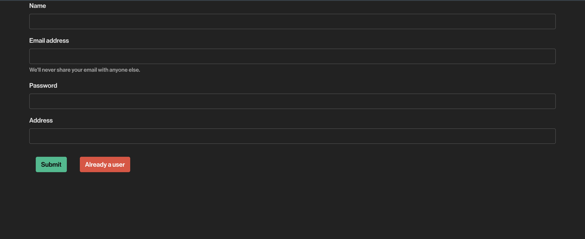

# Food Delivery Application

> A web application built using ReactJS, NodeJS and MongoDB with user registratin and login which displays a dynamic menu of food items and also has cart functionality which saves items added by users.

## Features

- User Registration and Authentication: Users can create accounts, log in, and manage their profiles.
- Food Catalog: Browse and search for dishes in various categories.
- Cart: Add products to the cart, review the cart, and proceed to checkout.

## Technologies Used

- Backend: NodeJS, ExpressJS
- Database: MongoDB
- Frontend: HTML, CSS, JavaScript, ReactJS

## Installation

1. Clone the repository:

```
git clone https://github.com/akhiranandan/gofood.git
```

2. Navigate to the project directory:

```
cd gofood
```

3. Install dependencies:

```
npm install
```

4. Start the server:

```
npm start
```

6. Access the application in your browser at `http://localhost:3000`

7. For running the backend, navigate to the backend folder in new terminal window.

```
cd backend
```

4. Start the server:

```
npx nodemon index.js
```

## App Previews

### Home Page


### Dishes


### Cart


### LogIn


### SignUp

